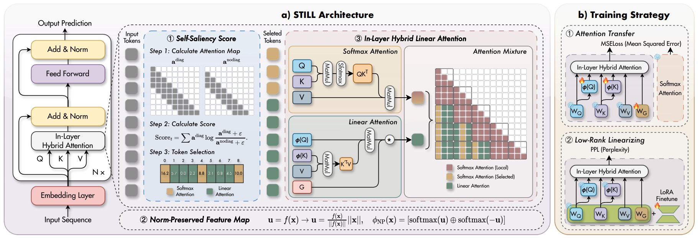
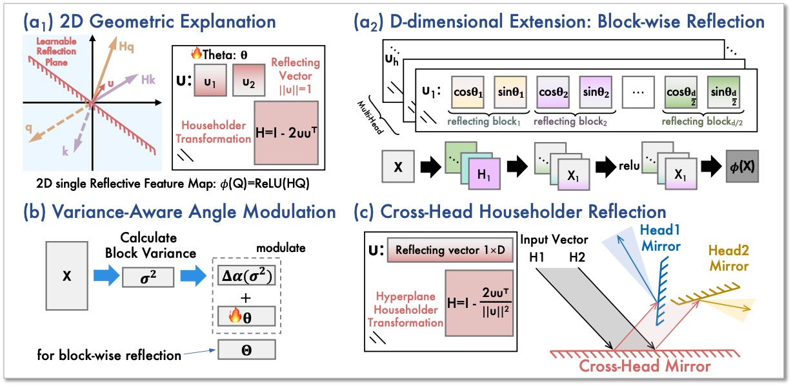
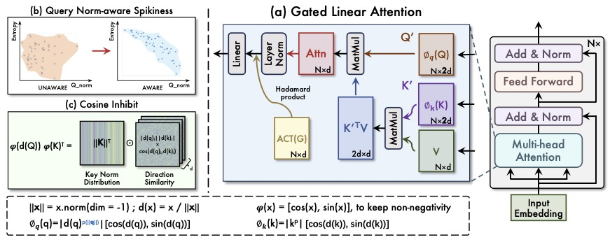
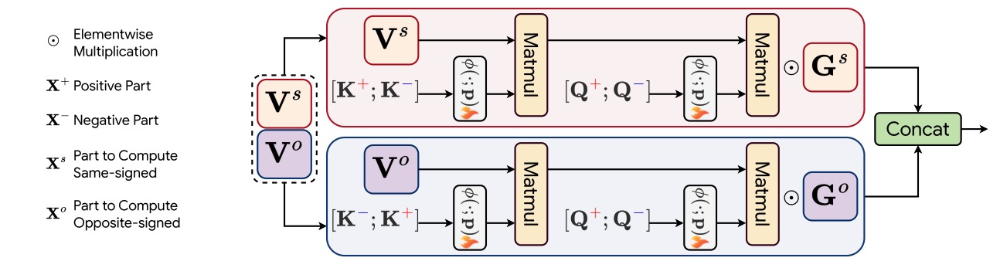








# About me
Weikang (Zachary) is a third-year Ph.D. candidate (2023-) at [SMULL Group](https://cszhengzhang.cn/SMULL/) of [HITsz CS](http://cs.hitsz.edu.cn) advised by Prof. [Zheng Zhang](https://cszhengzhang.cn/). He received his B.S. degree in Information and Computational Science at [Harbin Institute of Technology](https://www.hit.edu.cn/) in 2023. His research interests lie in efficient training and inference algorithms for large-scale foundation models, particularly linear attentions.

# News
- *2026.01*: &nbsp;📮📮 Our new work "[STILL: Selecting Tokens for Intra-Layer Hybrid Attention to Linearize LLMs](https://arxiv.org/abs/2602.02180)" has been uploaded to arXiv.
- *2026.01*: &nbsp;📮📮 Our new work "[MirrorLA: Reflecting Feature Map for Vision Linear Attention](https://arxiv.org/abs/2602.04346)" has been uploaded to arXiv.
- *2025.06*: &nbsp;📮📮 Our new work "[Norm×Direction: Restoring the Missing Query Norm in Vision Linear Attention](https://arxiv.org/abs/2506.21137)" has been uploaded to arXiv.
- *2025.01*: &nbsp;🎉🎉 "[PolaFormer: Polarity-aware Linear Attention for Vision Transformers](https://arxiv.org/abs/2501.15061)" is accepted to ICLR'25. 

# Publications 

New Work

**STILL: Selecting Tokens for Intra-Layer Hybrid Attention to Linearize LLMs.** [[paper](https://arxiv.org/pdf/2602.02180)][[code](https://github.com/ZacharyMeng/STILL)]

***Weikang Meng***, *Liangyu Huo*, *Yadan Luo*, *Jiawen Guan*, *Jingyi Zhang*, *Yingjian Li*, *Zheng Zhang*

This work proposes STILL, an intra-layer hybrid attention framework to efficiently linearize pretrained LLMs while preserving their original capabilities. STILL introduces a Self-Saliency Score with strong local–global consistency to select a small set of globally important tokens for sparse softmax attention, while summarizing the remaining context with linear attention. To mitigate distribution shift during linearization, it further proposes a Norm-Preserved Feature Map (NP-Map) that decouples direction from magnitude and reinjects the pretrained norms, and adopts a unified chunk-wise (delayed) selection strategy to improve training and inference efficiency for long-context generation.

New Work

**MirrorLA: Reflecting Feature Map for Vision Linear Attention.** [[paper](https://arxiv.org/pdf/2602.04346)]

***Weikang Meng***, *Liangyu Huo*, *Yadan Luo*, *Yaowei Wang*, *Yingjian Li*, *Zheng Zhang*

This work proposes MirrorLA, a linear attention framework that improves the expressivity of non-negative kernel feature maps by replacing passive truncation with active geometric reorientation. It introduces learnable Householder reflections to rotate informative components into the non-negative region while preserving inner-product structure, reducing information loss and stabilizing long-context behavior. MirrorLA further extends this idea with block-wise and cross-head geometric modulations, achieving stronger performance without sacrificing linear-time attention.

New Work

**Norm×Direction: Restoring the Missing Query Norm in Vision Linear Attention.** [[paper](https://arxiv.org/abs/2506.21137)]

***Weikang Meng***, *Yadan Luo*, *Liangyu Huo*, *Yaowei Wang*, *Xin Li*, *Zheng Zhang*

This work introduced a linear attention mechanism for Transformer-based models, called NaLaFormer. Based on the Positive Sequence Entropy (PSE), this work theoretically analysed the dynamic entropy reduction of softmax attention controlled by query norm and proposed the norm-aware kernel function. In addition, NaLaFormer utilized the Ptolemy's theorem to keep the non-negative constrain of the attention weight.

ICLR 2025

**PolaFormer: Polarity-aware Linear Attention for Vision Transformers.** [[paper](https://arxiv.org/abs/2501.15061)][[code](https://github.com/ZacharyMeng/PolaFormer)]

***Weikang Meng***, *Yadan Luo*, *Xin Li*, *Dongmei Jiang*, *Zheng Zhang*

This work presented a novel attention mechanism with linear complexity called PolaFormer. Our PolaFormer computed the similarity in a polarity-aware form to avoid neglecting negatives, at the same time, we theoretically proposed a familty of element-wise functions to make the attention weight more spiky and employ a learnable power function for simplicity and rescaling.

# Talks
- *2025.10*: Invited interview by Vitalbridge(绿洲资本) on our ICLR 2025 paper **PolaFormer** and efficient architectures. [[Link](https://mp.weixin.qq.com/s/GHoGj-mwUYzSAdCt_Jt8eA)]

# Honors and Awards
- *2018.09*, National High School Mathematics League, Provincial first prize

# Educations
- *2023.08 - now*, Ph.D student, Harbin Institute of Technology, Shenzhen, School of Computer Science and Technology, Computer Science and Technology
- *2019.08 - 2023.07*, Undergrauate student, Harbin Institute of Technology, School of Mathematics, Information and Computational Science
- *2016.08 - 2019.07*, Harbin NO.3 High School

